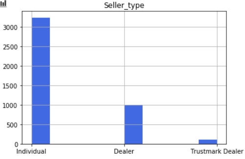
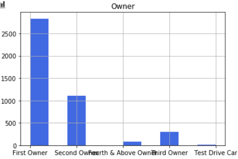

# Car Prices

**_The Problem_**

Analyze trends in car attributes that contribute most to their sale and build a linear regression model to predict prices._

**_Data extraction_**

The data was extracted from the following link: https://www.kaggle.com/nehalbirla/vehicle-dataset-from-cardekho

**_EDA_**

Analyze the data using descriptive statistics.

First, let's check the existing data types, using the .dtypes function. We can see that there are three columns of the integer type and four columns of the object type.
Analyzing the "fuel", "seller_type", "transmission" and "owner" columns, it can be seen that there is a predominance of car sales for diesel and petrol. As well as, individual seller type and cars with manual transmission. And almost triple sales for cars with the first owner.

|  |  |
|:-:|:-:|:-:|
|  |  |

We separate the column "name" as it does not matter for our analysis.

Now we are going to use the _.describe()_ function to return the descriptive statistics values for the columns of the integer type. We can start with measures of central tendency:

- Mean: indicates where the values are concentrated. 

1. Year: 2013;
2. Selling_price: 5.041273e+05;
3. Km_driven: 66215.777419;

- Median: is the value that separates the upper half from the lower half of a data distribution. By default, we can adopt the percentage of 50%.

1. Year: 2014;
2. Selling_price: 3.500000e+0;
3. Km_driven: 60000.000000;

- Mode: is the most repeated value.

1. Year: 2017;
2. Selling_price: 300000;
3. Km_driven: 70000;

_Dispersion Measures:_

- Amplitude: returns the maximum and minimum values.

1. Year: 2020 - 1992;
2. Selling_price: 8.900000e+06 - 2.000000e+04;
3. Km_driven: 806599.000000 - 1.000000;

- Variance: expressed as the data of a set are far from its expected value.

1. Year: 17.769124530169517;
2. Selling_price: 334718640087.90295;
3. Km_driven: 2175672269.448949;

- Standard deviation: expresses how far the data are away from the mean.

1. Year: 4.215344;
2. Selling_price: 5.785487e+0;
3. Km_driven: 46644.102194;

- Correlation:

We want to know if two variables have any relationship with each other within this data set. For these cases, we can calculate the correlation. It can be seen that there is not a strong dependence on the variables.

**_Data Preparation_**

Now we transform the object type variables into numeric ones with the Pandas get_dummies function.

**_Model creation_**

Create predictive models and predict future values and standards, in order to generalize occurrences and make decisions more efficient.

For this case study, the Linear Regression model was used.

**_Interpretation the results_**

Interpretation of defined models and collection of important business insights. 

Since we are dealing with a regression problem, the model's performance metrics are calculated through errors. The smaller the error, the better.

The MAE (Mean Absolute Error) and MAPE (Mean Absolute Percentage Error) of the training and test data were high. We applied the Cross-Validation that showed what was foreseen by MAE and MAPE. In other words, our model was unable to return a satisfactory result. 

As a solution proposal we can, in the next step, analyze the outliers. For Linear Regression is an algorithm very sensitive to outliers. And if the data set has too many anomalous values, tools like the mean and the variance may not work well.

